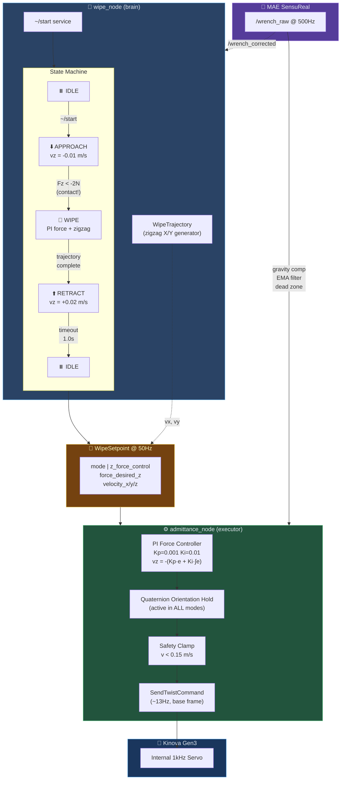
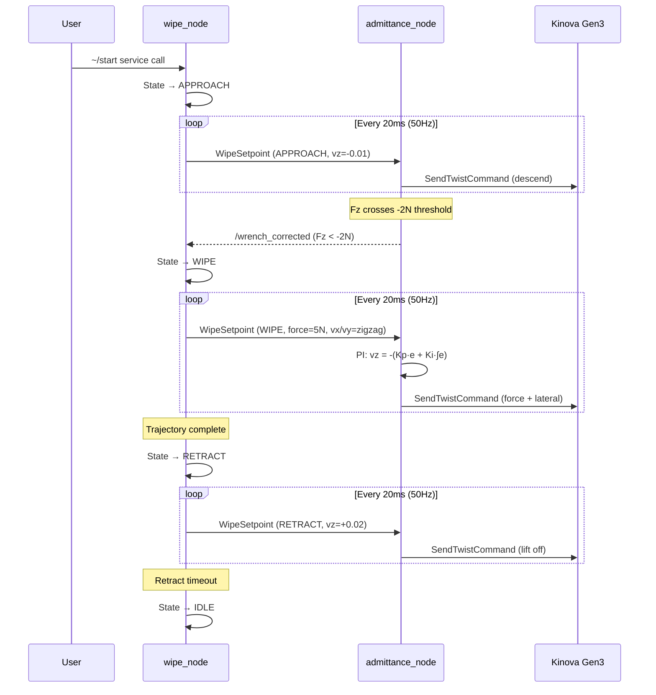

# Surface Wipe — Force-Controlled Wiping Demo

Autonomous surface wiping for the Kinova Gen3 arm using a 4-state machine that
coordinates force-controlled contact with lateral zigzag trajectories. The arm
approaches a surface, detects contact via F/T sensor feedback, maintains constant
force while wiping, then retracts.

Successfully demonstrated June 2026: 5 N contact force, 0.02 m/s wipe speed,
3 lateral passes with 50 mm spacing.

## Architecture



## How It Works



## Sign Convention

The MAE sensor reads **negative Fz** when the tool presses into a surface
(contact direction is UP in the base frame). Contact detection uses
`fz < -contact_threshold_`. The PI controller receives `-fz` to flip the
sign for positive-target tracking.

## Packages

| Package | Language | Role |
|---------|----------|------|
| `surface_wipe` | C++ | wipe_node (state machine) + WipeTrajectory |
| `wipe_msgs` | ROS2 msg | WipeSetpoint message definition |
| `admittance_controller` | C++ | PI force executor (separate repo) |

## Parameters (wipe_node)

| Parameter | Default | Units | Description |
|-----------|---------|-------|-------------|
| `x_len` | 0.10 | m | Stroke length per pass |
| `row_spacing` | 0.05 | m | Y step between passes |
| `num_passes` | 3 | — | Number of lateral strokes |
| `wipe_speed` | 0.02 | m/s | Lateral speed during wiping |
| `approach_speed` | 0.01 | m/s | Descent speed (magnitude) |
| `contact_threshold` | 2.0 | N | Fz magnitude to detect contact |
| `force_desired` | 5.0 | N | Target contact force during wipe |
| `retract_speed` | 0.02 | m/s | Lift speed (magnitude) |
| `retract_duration` | 1.0 | s | How long to retract |

Live-tunable: `approach_speed`, `force_desired`, `contact_threshold`.

## Run

```bash
# Terminal 1: launch admittance controller + MAE sensor
ros2 launch admittance_controller admittance.launch.py

# Terminal 2: configure and activate MAE sensor
ros2 lifecycle set /mae_sensor_node configure
ros2 lifecycle set /mae_sensor_node activate

# Terminal 3: enable admittance controller
ros2 service call /admittance_node/enable std_srvs/srv/Trigger

# Terminal 4: launch wipe node
ros2 run surface_wipe wipe_node --ros-args -p wipe_speed:=0.02

# Terminal 5: start the wipe sequence
ros2 service call /wipe_node/start std_srvs/srv/Trigger
```

## WipeSetpoint Message

```
# wipe_msgs/msg/WipeSetpoint.msg
uint8 IDLE=0
uint8 APPROACH=1
uint8 WIPE=2
uint8 RETRACT=3

std_msgs/Header header
uint8   mode                # Current state
bool    z_force_control     # true = PI force control on Z
float64 force_desired_z     # Target contact force [N]
float64 velocity_x          # Lateral velocity [m/s]
float64 velocity_y          # Lateral velocity [m/s]
float64 velocity_z          # Vertical velocity [m/s] (APPROACH/RETRACT only)
```

## Validated Results (June 2026)

| Metric | Value |
|--------|-------|
| Target force | 5.0 N |
| Steady-state band | [-5.5, -4.5] N |
| Max overshoot | -7.0 N (at direction reversal) |
| Max undershoot | -3.0 N (during lateral motion) |
| Wipe speed | 0.02 m/s |
| Loop rate | ~13 Hz (Kortex API limited) |
| PI gains | Kp=0.001, Ki=0.01 |

## Known Limitations

1. **13 Hz update rate** — Kortex high-level API limits the force control loop
   to ~13 Hz. At 0.02 m/s, the arm moves 1.5 mm between updates. Adequate for
   wiping, insufficient for precision polishing.

2. **Force overshoot at reversals** — Ki integral windup during steady wiping
   causes up to 2× target force at wipe direction changes. Mitigation: reduce Ki
   or add direct integral clamp.

3. **No surface normal estimation** — assumes surface is horizontal (Z-axis in
   base frame). Tilted surfaces require either manual orientation or future
   integration with perception-based normal estimation.

4. **No adaptive force** — constant force target. Varying surface stiffness or
   curvature is not compensated.

## Dependencies

- [admittance_controller](https://github.com/Sahilnarola-1007/admittance-controller)
- [kinova_wrapper](https://github.com/Sahilnarola-1007/kinova-wrapper)
- wipe_msgs (co-located or separate repo)
- ROS2 Jazzy, geometry_msgs, std_srvs

## Author

Sahil Narola — MEng, Carleton University
Advanced Biomechatronics and Locomotion Lab, Ottawa
